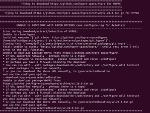

# 前期准备

## 下载与安装

*注：以下操作均在Linux中进行*

1. 进入[官网](https://petsc.org/release/install/download/#doc-download "PETSc官网")，下载相应版本并解压；

2. 并在解压后的文件夹中创建一个文件，如test；

3. 配置环境变量`export PETSC_DIR=/home/user/petscxx/xxx` （*注：PETSC_DIR后面的路径为解压后的文件绝对路径*）

4. 配置环境变量`export PETSC_ARCH=test`

5. 输入：`python3 ./configure --with-fPIC CXXFLAGS="-O3 -fPIC" --download-mpich --download-f2cblaslapack=1 --with-fc=0 --with-debugging=0 COPTFLAGS="-O3 -fPIC" FOPTFLAGS="-fPIC -O3" CXXOPTFLAGS="-O3 -fPIC" --download-hypre -with-c2html=0 --with-shared-libraries=1 --with-64-bit-indices`
    *注：期间可能会出现如下问题，是由于网络原因造成，多试几次或者去掉上述`download hypre`即可。*
    

6. 装好后按提示输入：`make PETSC_DIR=/home/user/petscxx/xxx PETSC_ARCH=test all`

7. 继续按提示输入：`make PETSC_DIR=/home/user/petscxx/xxx PETSC_ARCH=test check`

## 运行程序

至此，PETSc已安装完毕。**下面进行算例测试。**

```
cd $PETSC_DIR/src/ksp/ksp/tutorials    # 切换到算例文件下
make ex2&& ./ex2         # 编译并运行
```

如果安装了多个版本，进行不同版本的切换：`export PETSC_DIR=路径`

检查当前版本：`echo $PETSC_DIR`

<big>**创建自己的算例目录**</big>

1.	为源代码创建一个目录：`mkdir $HOME/application`
2.	切换到该目录：`cd $HOME/application`
3.	复制任意算例进入该目录：`cp $PETSC_DIR/src/snes/tutorials/ex19.c ex19.c`
4.	复制 `PETSC_DIR/share/petsc/Makefile.user` 或 `PETSC_DIR/share/petsc/Makefile.basic.user` 到该目录，如下：
   `cp $PETSC_DIR/share/petsc/Makefile.user makefile`
5.	检查生成文件中的注释
6.	Makefile.user 使用 pkg-config 工具，是推荐的方法。用于编译程序`make ex19`
7.	CMake。将 `PETSC_DIR/share/petsc/CMakeLists.txt`复制到该目录中，`cp $PETSC_DIR/share/petsc/CMakeLists.txt CMakeLists.txt`
8.	运行程序，例如，`./ex19`
9.	开始修改用于开发应用程序的程序。
*注：如果在运行时出错，可以在第4步中复制`Makefile.basic.user`。*